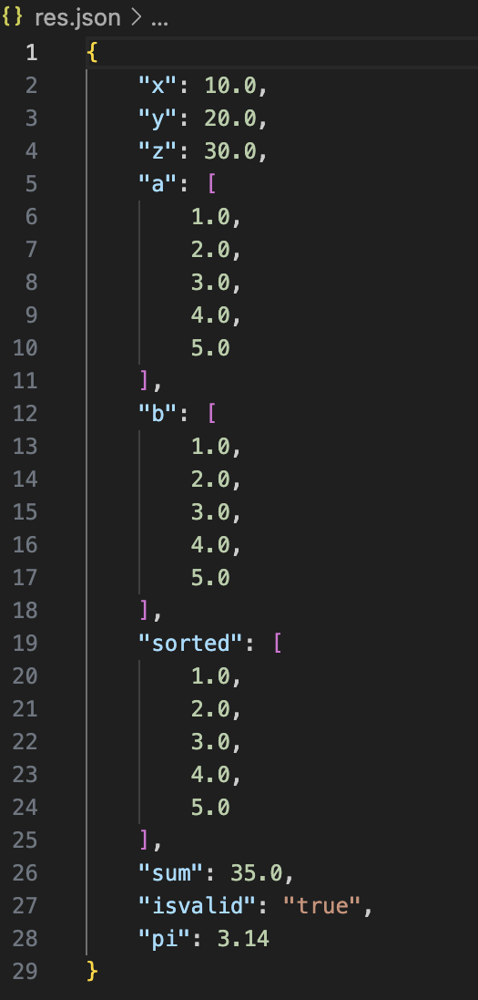
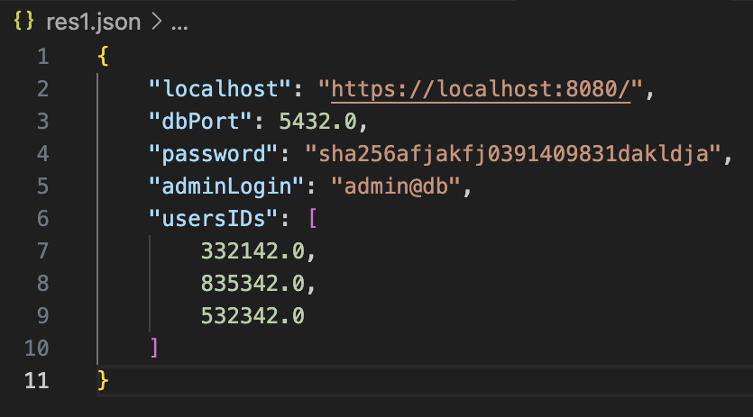
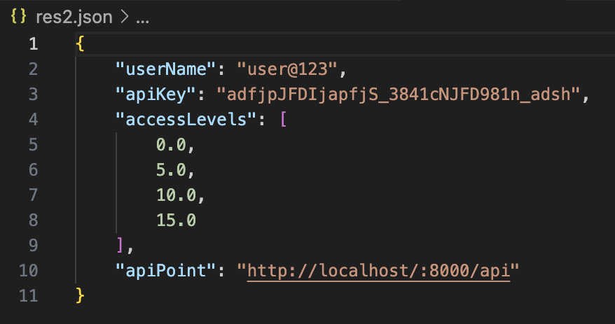
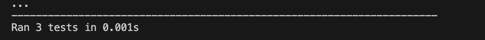

# Инструмент командной строки для трансляции учебного конфигурационного языка

## Общее описание

Данный проект представляет инструмент командной строки для трансляции текстов, написанных на учебном конфигурационном языке, в формат JSON. Инструмент обеспечивает:

Валидацию синтаксиса входного текста.
Поддержку всех синтаксических конструкций языка.
Генерацию сообщений об ошибках при обнаружении синтаксических ошибок.
Запись преобразованных данных в JSON-файл.
Входной текст задается с помощью файла, путь к которому передается через ключ командной строки. Выходной JSON записывается в указанный файл.

## Описание функций и настроек

### Основные функции
    1. read_file(file_path: str) -> List[str]
    Читает файл построчно и возвращает список строк.
    
    Пример использования:
    lines = read_file("config.kate")

    2. Parser(lines: List[str])
    
    Класс для обработки строк конфигурационного файла. Предоставляет метод get_data, который возвращает словарь с обработанными данными.
    
    Пример использования:
    parser = Parser(lines)
    data = parser.get_data()

    3. write_to_json(data: dict, output_path: str)
    
    Сериализует словарь данных в JSON-файл.
    
    Пример использования:
    
    write_to_json(data, "output.json")

### Синтаксис языка

    Объявление переменных:

    let a = 1
    let b = 'hello'
    let c = array(1, 2, 3)

    Комментарии:

    Однострочные:
    :: Это однострочный комментарий

    Многострочные:

    /+
    Это многострочный
    комментарий
    +/

    Массивы:
    Массивы объявляются через array.
    let d = array(4, 5, 6)
    
    Константные выражения:
    Постфиксная форма вычислений:
    ${a 1 +}

    Функции и операции:

    Сложение (+)
    Вычитание (-)
    Умножение (*)
    Сортировка массива (sort())
## Команды для сборки проекта

    Установка зависимостей:
    Все зависимости встроены, установка дополнительных библиотек не требуется.
    
    Запуск:
    Используйте команду:
    python main.py --input input.kate --output output.json
    
    Запуск тестов:
    Для проверки тестового покрытия:
    python -m unittest test_parser.py

## Пример использования 
")

")

")

